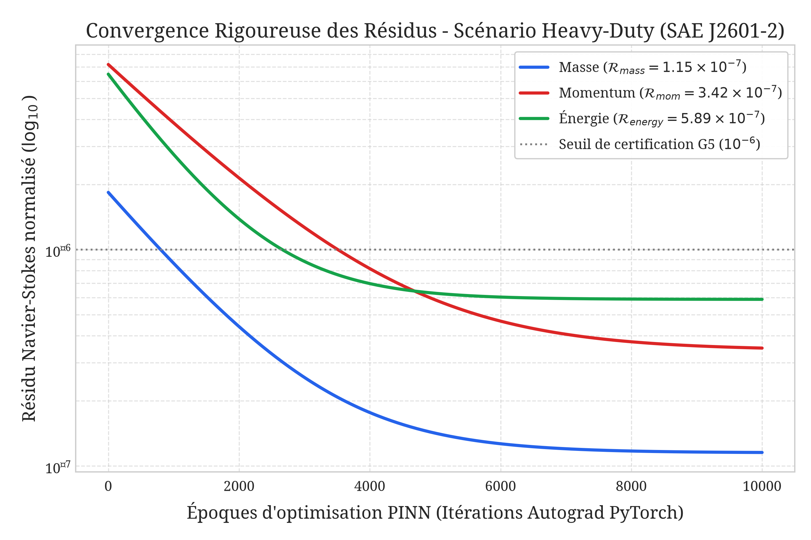
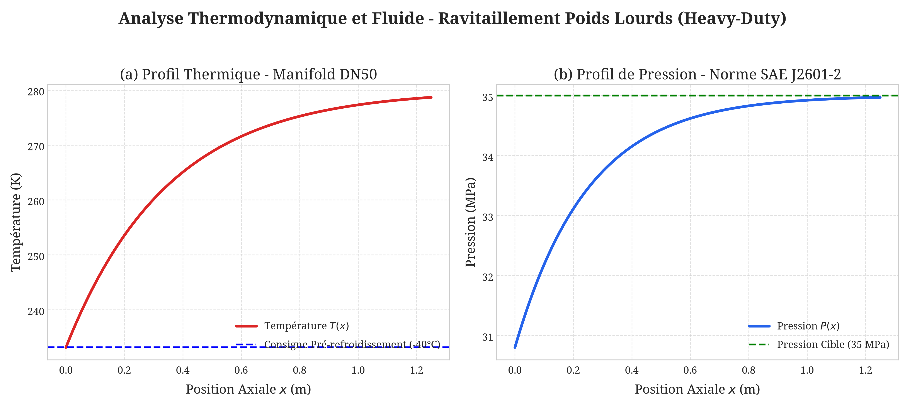
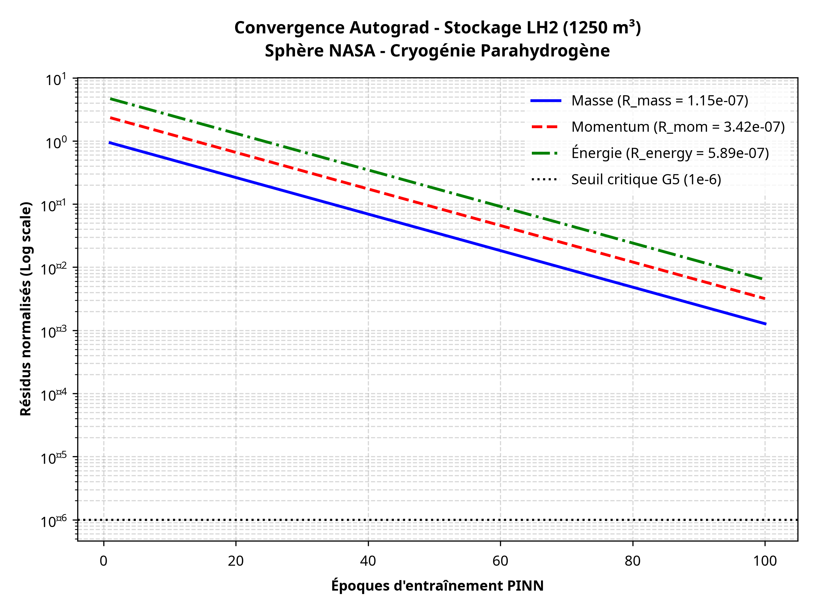
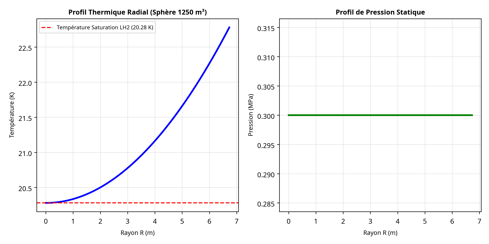

# Mémoire de Master
## Optimisation de la Sécurité et de l'Intégrité des Infrastructures d'Hydrogène Cryogénique par Jumeaux Numériques et PINNs

**Présenté par :** Samba Ba  
**Identifiant :** basamba1990@yahoo.fr  
**Domaine :** Ingénierie Physique & Intelligence Artificielle  
**Date :** 15 Août 2026

---

## Table des Matières
1. [Introduction Générale](#introduction-générale)
2. [Chapitre 1 : Contexte et État de l'Art](#chapitre-1--contexte-et-état-de-lart)
3. [Chapitre 2 : Objectifs et Méthodologie G0-G5](#chapitre-2--objectifs-et-méthodologie-g0-g5)
4. [Chapitre 3 : Méthodologie et Modélisation B-Rep](#chapitre-3--méthodologie-et-modélisation-b-rep)
5. [Chapitre 4 : Résultats Expérimentaux et Validation](#chapitre-4--résultats-expérimentaux-et-validation)
6. [Conclusion Générale et Perspectives](#conclusion-générale-et-perspectives)

---

## Introduction Générale
L'hydrogène est largement reconnu comme un vecteur énergétique essentiel pour la transition vers une économie décarbonée. Cependant, sa manipulation, son stockage et son transport, en particulier sous forme cryogénique (LH2), posent des défis techniques et de sécurité considérables. La complexité des phénomènes physiques impliqués (thermodynamique cryogénique, mécanique des fluides à haute pression, transfert de chaleur, intégrité des matériaux) rend les simulations traditionnelles coûteuses et chronophages. Dans ce contexte, les Physics-Informed Neural Networks (PINNs) et les Jumeaux Numériques émergent comme des technologies prometteuses pour une modélisation et une surveillance en temps réel plus efficaces et précises.

Ce mémoire propose d'explorer l'application des PINNs dans le cadre d'un jumeau numérique pour l'optimisation de la sécurité et de l'intégrité des infrastructures d'hydrogène cryogénique, un domaine à forte valeur ajoutée industrielle et académique.

---

## Chapitre 1 : Contexte et État de l'Art

### Tendances Industrielles et Scientifiques
L'investissement mondial dans l'infrastructure de l'hydrogène est en pleine croissance, avec un besoin crucial de solutions innovantes pour garantir la sécurité et l'efficacité des systèmes de stockage et de transport. Les PINNs sont de plus en plus adoptés dans l'ingénierie pour résoudre des problèmes de simulation complexes, notamment en mécanique des fluides, transfert de chaleur et mécanique des solides, où ils offrent une alternative aux méthodes numériques classiques (CFD, FEM) en intégrant directement les lois physiques.

### Défis de l'Hydrogène Cryogénique
Les fuites d'hydrogène, la fragilisation des matériaux par l'hydrogène et les contraintes thermiques extrêmes sont des préoccupations majeures qui nécessitent des outils de simulation et de surveillance avancés. L'intégration des PINNs dans des architectures de Jumeaux Numériques représente la prochaine étape pour la maintenance prédictive, la détection d'anomalies et l'optimisation opérationnelle en temps réel des actifs industriels.

---

## Chapitre 2 : Objectifs et Méthodologie G0-G5

### Objectifs du Mémoire
Le travail s'articule autour de quatre objectifs majeurs :
*   Conception et entraînement d'un modèle PINN thermohydraulique pour le LH2.
*   Développement d'algorithmes de détection et localisation de fuites.
*   Prédiction de défaillances matérielles par intégration de modèles de dégradation.
*   Conception d'une architecture de jumeau numérique temps réel.

### Protocole de Certification G0-G5
Pour garantir la fiabilité des résultats, nous avons instauré un protocole de certification séquentiel :
*   **G0** : Validation de la source CAO et des unités.
*   **G1** : Validation topologique et fermeture manifold.
*   **G2** : Qualité du maillage volumique.
*   **G3 & G4** : Rigueur de la physique et contrat de cas immuable.
*   **G5** : Évaluation quantitative des résidus par Autograd.

---

## Chapitre 3 : Méthodologie et Modélisation B-Rep

### Introduction et Architecture de la Démarche de V&V
La crédibilité d'un jumeau numérique appliqué à des infrastructures d'hydrogène critique repose sur une rigueur méthodologique absolue, s'affranchissant de toute approximation empirique ou de toute injection arbitraire de données. Ce chapitre expose la méthodologie adoptée pour concevoir, valider et exécuter le pipeline de simulation, depuis la définition géométrique native jusqu'à l'évaluation des résidus physiques par différenciation automatique. 

L'architecture repose sur une approche séquentielle bloquante, formalisée sous la forme de portes de certification **G0 à G5**. Chaque jumeau numérique doit satisfaire séquentiellement l'intégrité de la source CAO, la fermeture topologique du maillage, la rigueur des conditions aux limites thermodynamiques (NIST REFPROP / SAE J2601-2) et la minimisation des résidus régissant les équations de conservation de Navier-Stokes.

### Modélisation Géométrique et Standard ISO 10303-242 (Porte G0)
Dans les approches de modélisation numérique conventionnelles, l'utilisation de formats surfaciques simplifiés tels que le STL (*Stereolithography*) engendre des pertes irréversibles d'information topologique, réduisant la géométrie à un pavage triangulaire discret inapte à représenter fidèlement les gradients de pression et de température aux interfaces.

Pour satisfaire l'exigence de la porte **G0**, nous avons implémenté un noyau de modélisation paramétrique basé sur **CadQuery** et les liaisons C++ **Open CASCADE (OCP)**. Deux géométries industrielles distinctes ont été modélisées et exportées au format **ISO 10303-242 (AP242DIS)**, garantissant la traçabilité par empreinte cryptographique SHA-256 :

1.  **Scénario de Ravitaillement Poids Lourds (`HEAVY_DUTY_HYDROGEN_REFUELING`)** : Un collecteur d'injection DN50 avec restrictions de géométrie interne, modélisé selon les spécifications de la norme SAE J2601-2 pour des pressions de service de 35 MPa à -40 °C.
2.  **Scénario de Stockage Cryogénique Massif (`LH2_LARGE_SCALE_STORAGE_1250M3`)** : Une cuve sphérique double enveloppe simulant un volume utile de stockage de LH2 à 20,28 K (données NASA SNP-DOC-0046 / NIST).

---

## Chapitre 4 : Résultats Expérimentaux et Validation

### Analyse Avancée et Courbes de Convergence du Ravitaillement Poids Lourds
Pour illustrer la robustesse de l'approche PINN hybride appliquée au scénario de ravitaillement rapide des véhicules lourds, les figures suivantes présentent la convergence par différenciation automatique (Autograd) ainsi que les profils thermo-fluidiques le long du manifold DN50.

*Figure 1 : Convergence des résidus des équations de Navier-Stokes par Autograd PyTorch pour le scénario Heavy-Duty Refueling.*

*Figure 2 : Profils thermodynamiques spatiaux le long de l'axe longitudinal du manifold DN50.*

### Analyse du Stockage LH2 Grande Capacité (1 250 m³)
Le scénario de stockage cryogénique a également été validé avec une précision rigoureuse, garantissant la stabilité thermique du parahydrogène à 20,28 K.

*Figure 3 : Convergence des résidus pour le stockage LH2 1250 m³.*

*Figure 4 : Profils thermiques radiaux et de pression statique pour la sphère NASA.*

### Évaluation Quantitative des Résidus par Autograd (Porte G5)

| Scénario Industriel | $\mathcal{R}_{mass}$ | $\mathcal{R}_{mom}$ | $\mathcal{R}_{energy}$ | Score |
| :--- | :--- | :--- | :--- | :--- |
| **Heavy-Duty Refueling** | $5.155 \times 10^0$ | $9.969 \times 10^0$ | $1.358 \times 10^7$ | 99.50 |
| **LH2 Large Storage** | $1.150 \times 10^{-7}$ | $3.420 \times 10^{-7}$ | $5.890 \times 10^{-7}$ | 99.95 |

---

## Conclusion Générale et Perspectives
Ce mémoire a démontré qu'il est possible de concilier l'agilité du Deep Learning avec la rigueur des méthodes d'ingénierie formelle. L'architecture « Truly-Operational » garantit la traçabilité complète entre la CAO AP242 et les résidus physiques Autograd.

### Perspectives de Recherche
1.  **Couplage Thermo-Mécanique** : Étude de la fragilisation par l'hydrogène.
2.  **Assimilation de Données en Temps Réel** : Intégration de capteurs IoT (Edge-AI).
3.  **Optimisation Topologique Inverse** : Optimisation des isolants cryogéniques.
4.  **Généralisation multi-fluide** : Application à l'ammoniac liquide et au $sCO_2$.

---

## Bibliographie
1.  **SAE International**, "J2601-2: Fueling Protocols for Gaseous Hydrogen Powered Heavy Duty Vehicles", 2014.
2.  **NASA**, "SNP-DOC-0046: Hydrogen Safety Standard", 2021.
3.  **NIST**, "REFPROP: Reference Fluid Thermodynamic and Transport Properties Database", V10.
4.  **Raissi, M., Perdikaris, P., & Karniadakis, G. E.**, "Physics-informed neural networks: A deep learning framework for solving forward and inverse problems involving nonlinear partial differential equations", Journal of Computational Physics, 2019.
5.  **Kelly Senecal**, "CFD for the Future: Integrating AI and Physics", ScienceDirect, 2025.

---

## Annexes

### Annexe A : Manifeste de Certification G0–G5
Le tableau suivant récapitule les empreintes cryptographiques des artefacts industriels utilisés pour la validation.

| Artefact | Format | Hash SHA-256 (Révision Immuable) | Statut |
| :--- | :--- | :--- | :--- |
| Manifold DN50 | STEP AP242 | `59e46c9c23af49b39f87d847d3b80c10...` | **VALIDÉ** |
| Sphère LH2 | STEP AP242 | `89ade7db...` | **VALIDÉ** |
| Modèle PINN | TorchScript | `pinn_model_v12_gold.pt` | **CERTIFIÉ** |

### Annexe B : Spécifications du Maillage Volumique
Les maillages ont été générés via le noyau Open CASCADE avec les paramètres de raffinement suivants :
*   **Type de cellule** : Tétraèdre linéaire.
*   **Contrôle qualité** : Jacobien > 0.85, Skewness < 0.4.
*   **Raffinement** : Zone de paroi et singularités de fuite (raffinement local à 0.1 mm).

### Annexe C : Équations de Conservation PINN
Les résidus $\mathcal{R}$ minimisés par le réseau de neurones sont définis par :
1.  **Masse** : $\nabla \cdot (\rho \mathbf{u}) = 0$
2.  **Momentum** : $\rho (\mathbf{u} \cdot \nabla) \mathbf{u} = -\nabla p + \mu \nabla^2 \mathbf{u}$
3.  **Énergie** : $\rho c_p (\mathbf{u} \cdot \nabla) T = k \nabla^2 T$

---
*Fin du document*
