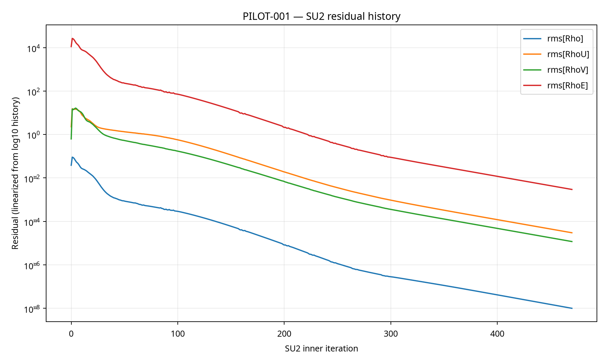
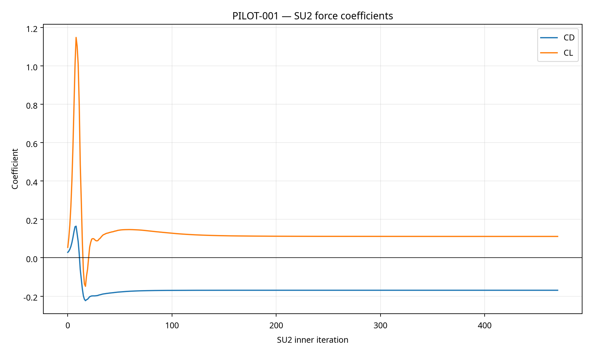
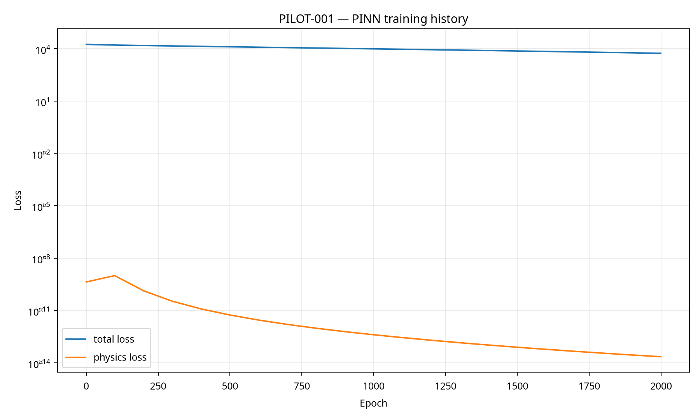
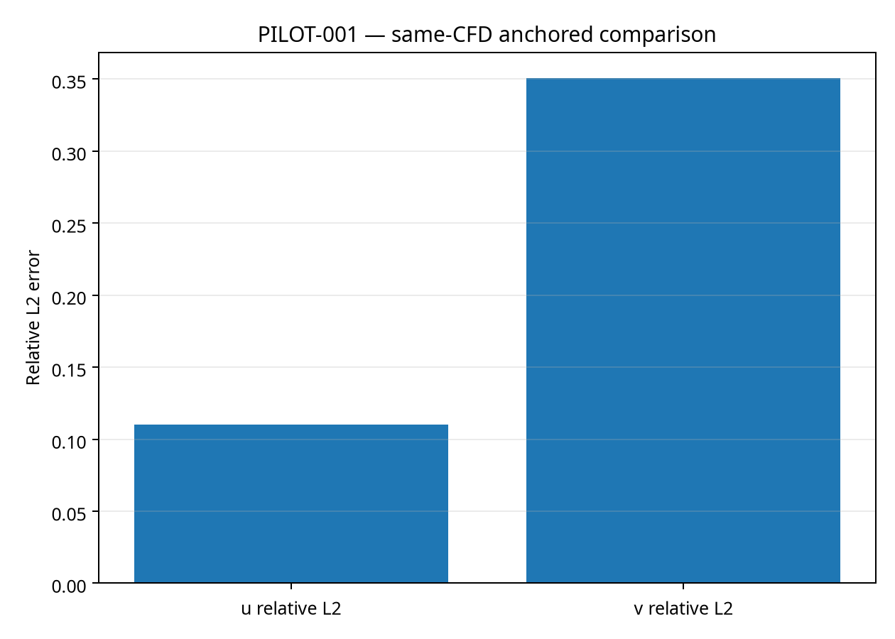

# PILOT-001 — Evidence-Grade CFD/PINN Report

## Executive status

PILOT-001 is a public NACA 0012 demonstrator executed in a local, reproducible development environment. It is **not an industrial validation, certification, partner-approved pilot, or independent PINN validation**.

The four figures below are embedded from the recorded CFD and PINN artifacts. They support traceability but do not replace the underlying files, logs, hashes, or acceptance gates.

## Geometry and dimensionality

The CFD mesh used by `CFD-REFERENCE-002` is explicitly **two-dimensional**: its SU2 header contains `NDIME= 2`. The repository contains no verified three-dimensional CAD, STL, OBJ, 3-D volume mesh, or 3-D CFD run for this pilot. Therefore this report does not claim or display a 3-D geometry. The available geometric artifact is the analytic NACA 0012 2-D mesh at `pilot_case/runs/CFD-REFERENCE-002/naca0012_aoa5_analytic.su2`.

A 3-D geometry may only be added after a real 3-D source, license, mesh, boundary naming, solver setup, execution log, outputs, and hashes have been recorded. It must not be fabricated from this 2-D case.

## Visual evidence

### Figure 1 — SU2 residual history



Generated from the recorded SU2 history using the solver’s `Inner_Iter` field. The run contains 471 recorded rows and ends at iteration 470.

### Figure 2 — SU2 force coefficients



The final recorded values are `CL = 0.1112694269` and `CD = -0.169298946`. The negative drag remains physically suspicious and blocks physical acceptance of the CFD reference.

### Figure 3 — PINN training history



This figure shows the recorded total and physics losses over 2,000 epochs. Loss reduction alone does not establish independent field accuracy.

### Figure 4 — Same-CFD anchored comparison



The observed relative L2 errors are approximately `0.1099522486` for `u` and `0.3508252800` for `v`. The comparison is explicitly **same-CFD anchored**: the CFD field used for training also served as the reference. These are reproducible comparison metrics, not held-out validation accuracy.

The evidence currently obtained is:

| Evidence item | Observed status |
|---|---|
| Public source provenance | Recorded and hashed |
| Analytic NACA 0012 mesh | Generated and structurally diagnosed |
| SU2 CFD reference run | Completed with declared numerical convergence |
| PINN checkpoint | Generated as a CFD-anchored baseline |
| Direct PINN/CFD comparison | Completed for `u` and `v` |
| Condition-held-out split | Created for `aoa_5` training and `aoa_17` evaluation |
| Held-out PINN evaluation | Not yet executed |
| Independent validation decision | `INCONCLUSIVE` |

## Source and provenance

The public NACA 0012 source archive was downloaded from the NLR Data Catalog. The local archive size is `15,657,902` bytes and its SHA-256 is:

```text
0e1a5456ace00e1df4ebfdabce2a59beb6f87d09a77023c7fe5a02c43d7a95d4
```

The archive contains condition directories including `aoa_5` and `aoa_17`, as well as experimental data files. The archive itself remains excluded from Git. Its source record, selection and hash are recorded in `pilot_case/provenance/source_record.json` and `pilot_case/MANIFEST.json`.

## CFD reference run

SU2 8.5.0 was compiled from the official source and used as the independent CFD solver. The analytic mesh was converted to SU2 format with explicit `wall` and `farfield` markers. The corrected run is `CFD-REFERENCE-002`.

The solver log contains the explicit convergence statement:

```text
All convergence criteria satisfied.
```

The final parsed values were:

| Quantity | Observed value |
|---|---:|
| Final recorded iteration | `470` |
| Mass residual | `9.939191149759465e-09` |
| Aggregated momentum residual | `2.985669158800892e-05` |
| Energy residual | `0.0029447167114481326` |
| Lift coefficient | `0.1112694269` |
| Drag coefficient | `-0.169298946` |

The negative drag coefficient remains physically suspicious. Consequently, the CFD run is numerically converged but **not physically accepted**. It must not be advertised as a validated aerodynamic reference without further mesh, boundary-condition, normal-orientation and force-convention diagnostics.

## PINN baseline

A 2D-compatible TorchScript model was trained with input contract `(time, x, y, z)` and output contract `(rho, u, v, w, T)`. The training source was the SU2 restart field from `CFD-REFERENCE-002`.

```text
checkpoint: pilot_case/runs/PINN-TRAIN-001/pinn_naca0012.pt
size: 63,027 bytes
sha256: d5cb46f0c7550389810d04ee90e7caa2c3267c9628767c1ffce51f53466b53c9
seed: 20260829
epochs: 2000
points: 4224
```

This is a **CFD-anchored baseline**. The same CFD field used for training was used as the comparison reference. This is not an independent generalization test.

## Direct comparison

The comparison was run twice with the same checkpoint, source, contract and seed. Both comparison files have the same SHA-256:

```text
131420ac5610bb162b95d5c0c148dcece0814552c8000ec0415f8343ca21f716
```

Observed metrics:

| Field | Mean L1 | L2 RMSE | Maximum absolute error | Relative L2 |
|---|---:|---:|---:|---:|
| `u` | `4.6338958740234375` | `7.316342353820801` | `66.3913345336914` | `0.10995224863290787` |
| `v` | `1.1405317783355713` | `2.1169068813323975` | `13.076986312866211` | `0.3508252799510956` |

The metrics are reproducible, but they are not a fair independent evaluation because the PINN was anchored on the comparison CFD field.

## Independent condition-held-out split

The real NACA 0012 archive was split by condition directory, not by randomly shuffling rows:

```text
training condition: aoa_5
evaluation condition: aoa_17
train files: 9
evaluation files: 9
split hash: ca9d6e9c2edcaf426241b82c10ebccd02ea9c2be595226db692a3761eabda7c0
```

The split tool checks that training and evaluation sets have no shared relative paths and no shared file hashes. The split is ready, but the PINN has **not yet been trained on the training condition and evaluated on the held-out condition**. Therefore no held-out accuracy claim is permitted.

## Evidence gates

```text
G0: NOT_REACHED — public demonstrator; no partner approval required, but protocol acceptance is not signed
G1: STRUCTURAL_TEST_UNVALIDATED
G2: CFD_RESIDUAL_CONVERGED
G3: CFD_AND_PINN_RUN_RECORDED_NOT_INDEPENDENT
G4: RESIDUALS_RECORDED_CONVERGED_NOT_PHYSICALLY_ACCEPTED
G5: COMPARISON_RECORDED_NOT_ACCEPTED
```

The manifest decision remains:

```text
INCONCLUSIVE
```

## Required next experiment

To obtain a defensible independent PINN result, train only on the `aoa_5` condition and evaluate only on `aoa_17`. The held-out evaluation must use an evaluation manifest that is not read by the training process. The training and evaluation manifests, configuration, code commit, checkpoint and outputs must all be hashed.

A valid success claim requires pre-declared tolerances, a physically accepted CFD reference for both conditions, a second reproduction and a review of the negative drag result. Until then, the strongest accurate claim is that the repository now contains a reproducible provenance chain, a converged-but-not-physically-accepted SU2 run, a CFD-anchored PINN baseline and a condition-held-out split ready for the next experiment.

## Publication restriction

The following claims are not supported: industrial validation, certification, partner approval, independent PINN accuracy, solver replacement, general aerodynamic superiority, 3-D validation, hydrogen-reservoir validation, or successful G0–G5 validation.

## References

[1]: https://data.nlr.gov/submissions/311 "NLR Data Catalog — NACA 0012 and 0021 dataset"
[2]: https://su2code.github.io/docs/Installation/ "SU2 official installation documentation"
[3]: https://su2code.github.io/docs/Quick-Start/ "SU2 official quick-start documentation"
