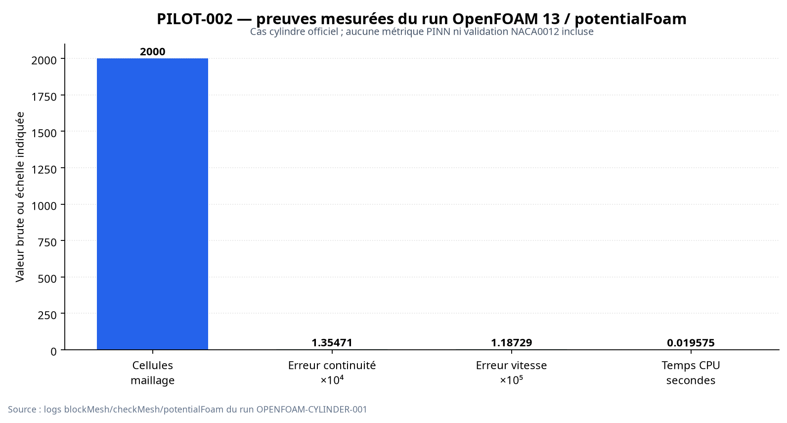

# PILOT-002 — Démonstrateur public OpenFOAM / cylindre

**Auteur : Manus AI**  
**Statut global : INCONCLUSIVE**  
**Run : `OPENFOAM-CYLINDER-001`**  
**Solveur : OpenFOAM Foundation 13 — `potentialFoam`**

## Résumé exécutif

PILOT-002 démontre une chaîne CFD OpenFOAM séparée du pilote SU2/NACA0012. Le cas est fondé sur le tutoriel officiel `potentialFoam/cylinder`. Le maillage a été construit par `blockMesh`, contrôlé par `checkMesh`, puis résolu par `potentialFoam`.

La chaîne numérique a produit des preuves réelles et traçables : **2 000 cellules**, `Mesh OK`, marqueur de fin `End`, erreur de continuité `1.35471e-4`, erreur de vitesse interpolée `1.18729e-5` et temps CPU `0.019575 s`. Ces éléments établissent l’exécution du cas OpenFOAM, mais ne suffisent pas à revendiquer une validation PINN-T complète.

> **Décision : INCONCLUSIVE.** Le run CFD OpenFOAM est documenté, mais les gates de validation PINN, les tolérances approuvées avant expérience et la seconde reproduction propre ne sont pas disponibles.

## Périmètre et séparation

| Élément | PILOT-002 |
|---|---|
| Solveur | OpenFOAM Foundation 13 |
| Application | `potentialFoam` |
| Géométrie | Cylindre 2D dans un domaine extrudé d’une cellule |
| Pilote distinct | Oui ; aucun artefact NACA0012/SU2 utilisé |
| Type de physique | Écoulement potentiel incompressible |
| PINN-T | Non exécuté dans ce run |
| Validation industrielle | Hors périmètre |

Le profil NACA0012 relève exclusivement de **PILOT-001/SU2**. Il n’est pas utilisé comme géométrie, maillage ou référence dans ce pilote.

## Preuves disponibles

| Preuve | Résultat | Fichier |
|---|---:|---|
| Génération du maillage | 2 000 cellules | `runs/blockMesh.log` |
| Contrôle topologique et géométrique | `Mesh OK` | `runs/checkMesh.log` |
| Résolution du potentiel | `End` présent | `runs/potentialFoam.log` |
| Erreur de continuité | `1.35471e-4` | `runs/potentialFoam.log` |
| Erreur de vitesse interpolée | `1.18729e-5` | `runs/potentialFoam.log` |
| Temps CPU | `0.019575 s` | `runs/potentialFoam.log` |
| Intégrité des artefacts | 4 fichiers vérifiés | `runs/output_hashes.sha256` |



## Évaluation des gates

| Gate | Décision | Justification |
|---|---|---|
| G0 | INCONCLUSIVE | Autorisation et tolérances du protocole PINN non enregistrées comme approuvées avant run |
| G1 | PASS | Maillage et topologie contrôlés par `checkMesh` |
| G2 | PASS limité | Run `potentialFoam` terminé ; portée limitée à l’écoulement potentiel |
| G3 | INCONCLUSIVE | Aucun entraînement PINN-T ni séparation train/évaluation exécuté |
| G4 | INCONCLUSIVE | Les logs CFD existent, mais les métriques comparatives PINN et bilans complets ne sont pas calculés |
| G5 | INCONCLUSIVE | Aucune seconde reproduction propre du protocole complet |

## Reproduction

Dans un environnement Ubuntu équipé d’OpenFOAM Foundation 13 :

```bash
cd Quantum-Hybrid-PINN
source /opt/openfoam13/etc/bashrc
./scripts/run_openfoam_cylinder.sh pilot_case/runs/OPENFOAM-CYLINDER-REPRO-002
sha256sum pilot_case/runs/OPENFOAM-CYLINDER-REPRO-002/*.log
```

La reproduction doit utiliser un environnement propre, conserver les versions, les commandes, les logs et les empreintes SHA-256. Toute divergence doit être documentée avant de recalculer une décision.

## Limites et prochaines étapes

PILOT-002 ne doit pas être présenté comme une validation de NACA0012, de SU2, de turbulence, de traînée visqueuse, de compressibilité, de PINN-T ou d’un système hydrogène. Pour obtenir un `PASS` de validation evidence-grade, il faut approuver les tolérances avant expérience, définir les métriques PINN, entraîner et évaluer séparément un modèle, puis répéter le protocole dans un environnement propre.

## Références

[1]: https://openfoam.org/download/13-ubuntu/ — OpenFOAM Foundation, « Download v13 | Ubuntu ».
[2]: https://www.openfoam.com/documentation/tutorial-guide/2-incompressible-flow/2.2-flow-around-a-cylinder — OpenFOAM, « Flow around a cylinder ».
