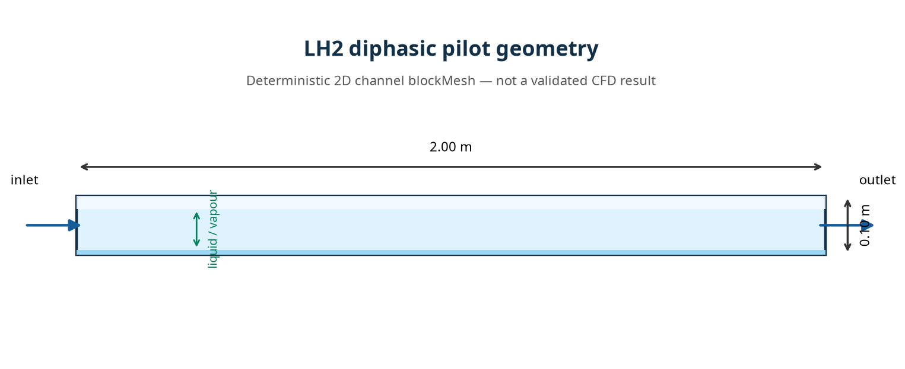

# Technical Report and Value Proposition — LH2 Pilot

## Positioning

The Quantum-Hybrid-PINN LH2 pilot is a software platform currently in the qualification phase. It is intended to support CFD services, industrial demonstrations, feasibility studies, and technology-transfer projects involving two-phase flows, cryogenic thermal processes, and scientific machine learning.

The platform already contains the building blocks of a reproducible evidence chain: a versioned data contract, SHA-256 verification, OpenFOAM preparation, CoolProp integration, compilation scripts, case automation, NaN/FPE detection, balance post-processing, and visualization generation.

The physical status of the pilot remains **INCONCLUSIVE**. This wording is deliberate and professional: the platform does not present an unstable simulation as an industrial validation.

## Completed Work

| Area | Completed work |
|---|---|
| Software infrastructure | Version-controlled repository, CFD contracts, controlled import, and artifact persistence |
| Docker | VFS diagnosis, overlay2 recommendations, BuildKit cache strategy, and systemd cleanup |
| LH2 initialization | `alpha.gas=0.01`, `alpha.liquid=0.99`, `maxCo=0.02` |
| Thermodynamics | CoolProp Python tests on bounded states and calculation of `psi` |
| C++ adapter | Fail-closed patch for absolute pressure, `Tsat(p)`, finite states, and `psi` |
| Execution | Sequential launcher for no-wall-boiling followed by wall1-only activation |
| Controls | Automatic stop on NaN, Inf, FPE, timeout, or missing balance data |
| Reporting | JSON report, SHA-256 manifests, charts, and decision summary |
| Communication | LH2 concept animation, geometry visuals, and a marketable commercial post |

## G0–G5 Status

| Gate | Current pilot status |
|---|---|
| G0 — Geometric identity | Conceptual visuals available; authorized LH2 CAD source, revision, and final hash still required |
| G1 — Boundaries | OpenFOAM dictionaries and patches available; final geometric closure evidence still to be completed |
| G2 — Mesh | Case artifacts available; production LH2 mesh-quality report missing |
| G3 — Configuration | Physical contract, CoolProp integration, and stability settings prepared |
| G4 — Execution | Scripts ready, but historical logs still contain NaN/FPE and the final VM has not been executed here |
| G5 — Validation | Independent reference, uncertainty analysis, two final runs, and approved thresholds are still missing |

## Available Media

The three `lh2_concept_animation_*.gif` files are conceptual animations, not solver outputs. The eighteen VTU files present in the repository belong to test kits or reference designs; no VTU generated by a final OpenFOAM LH2 trajectory has been identified under `pilot_case/PILOT-LH2-001`. The two available STL files belong to the demonstration cylinder case and do not represent an industrial LH2 geometry.

When presented, the conceptual VTU files must be labeled **REFERENCE_DESIGN** or **SYNTHETIC_TEST**. A marketable CFD animation must be exported from real OpenFOAM frames after convergence and balance verification.

## Relevant Visualizations

### Conceptual Pilot Geometry

*Figure 1 — Conceptual 2D domain of the LH2 pilot, showing the inlet, outlet, and liquid/vapor regions. This figure is relevant for explaining the preliminary geometric identity and the case contract. It is explicitly **conceptual** and **does not constitute a validated CFD result or evidence of industrial geometry**.*

### Available Residual Diagnostics

*Figure 2 — Diagnostic of the residuals actually available. The displayed residuals are high and non-convergent; the energy-balance panel is empty because no real energy-balance CSV was available at the time of the audit. This figure is relevant for documenting the **INCONCLUSIVE** status, but it must not be presented as a converged comparison between two simulations.*

### Media Not Relevant as CFD Evidence

The conceptual GIFs, synthetic or reference-design VTU files, and cylinder-case STL files may illustrate the interface, geometry, or visualization workflow. They are not relevant as evidence of OpenFOAM LH2 convergence and must remain labeled **CONCEPTUAL**, **SYNTHETIC_TEST**, or **REFERENCE_DESIGN**.

## Main Technical Risk

Activating wall boiling currently triggers an interfacial instability observed in `Tf.gasAndLiquid` and `iDmdt.gasAndLiquid`. The risk-reduction sequence is already defined: thermodynamic verification without wall boiling, activation on one wall, monitoring of `p,T,rho,psi,alphat,iDmdt`, and then two independent trajectories.

The project should be presented as an **instrumented qualification and engineering-service capability**, not as a certification that has already been obtained. Its commercial value lies in reducing diagnostic time, improving assumption traceability, and automatically preventing the publication of results that have not been demonstrated.

## Potential Commercial Offers

| Offer | Commercial deliverable |
|---|---|
| CFD model audit | Review of dictionaries, properties, boundary conditions, mesh, and residuals |
| Simulation service | Prepared OpenFOAM case, controlled execution, logs, and decision report |
| Data validation | VTU/VTK import, topology checks, unit checks, hashes, and provenance |
| PINN-T integration | Separate training set, held-out evaluation, metrics, and reproducibility package |
| Industrial demonstrator | Dashboard, animations, and exports based on authorized cases |
| Financial collaboration | Financing of a reference case, data acquisition, and joint qualification of artifacts |

## Conditions for Production Release

The LH2 production capability must not be announced until compilation has been completed in a full OpenFOAM VM, two independent runs have produced no non-finite values, residuals have been controlled, mass and energy balances are available, complete SHA-256 manifests have been produced, and the results have been compared with a reference defined before evaluation.

## Conclusion

The pilot provides a credible foundation for offering CFD/PINN-T qualification services, an industrial demonstrator, or a commercial development collaboration. Its current strengths are transparency and instrumentation. Its next step is a real OpenFOAM execution in a complete VM and the production of final physical evidence.

> **Current status: INCONCLUSIVE — industrial presentation possible as a qualification platform; CFD validation not yet demonstrated.**

## References

[1]: https://docs.docker.com/engine/storage/drivers/overlayfs-driver/ "Docker OverlayFS storage driver"
[2]: https://docs.openfoam.com/ "OpenFOAM documentation"
[3]: https://coolprop.org/ "CoolProp documentation"

*Prepared by Manus AI.*

---

# Industrial Value Proposition

Quantum-Hybrid-PINN is designed for organizations that need a controlled path from thermofluid simulation data to an auditable engineering decision. The platform connects geometry, mesh, thermodynamic properties, solver configuration, residuals, conservation balances, hashes, and visualizations in one traceable workflow.

The LH2 pilot demonstrates the operational foundation for cryogenic and multiphase use cases. It includes stability preparation, CoolProp-based thermodynamic checks, fail-closed numerical guards, sequential test execution, automated post-processing, and controlled visualization exports.

The present opportunity is not to claim a completed certification. It is to provide an industrial service that helps teams identify weak assumptions, reproduce calculations, organize evidence, and prepare a reliable technical dossier before design, investment, procurement, or industrialization decisions.

Potential engagement formats include a fixed-scope CFD audit, a paid proof of concept, deployment of a qualification dashboard, integration with an existing simulation workflow, or a jointly financed reference case. Each engagement can be governed by a clear acceptance matrix, defined data ownership, explicit confidentiality rules, and a staged decision process.

The immediate next milestone is the execution of the LH2 case in an approved OpenFOAM environment, followed by independent reproduction, mass-energy balance verification, and release of a complete evidence package.
