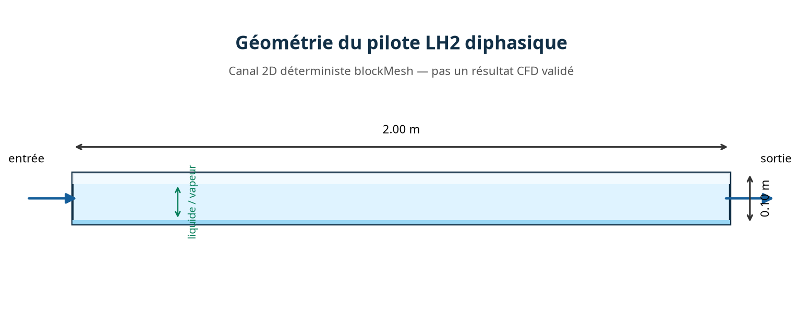
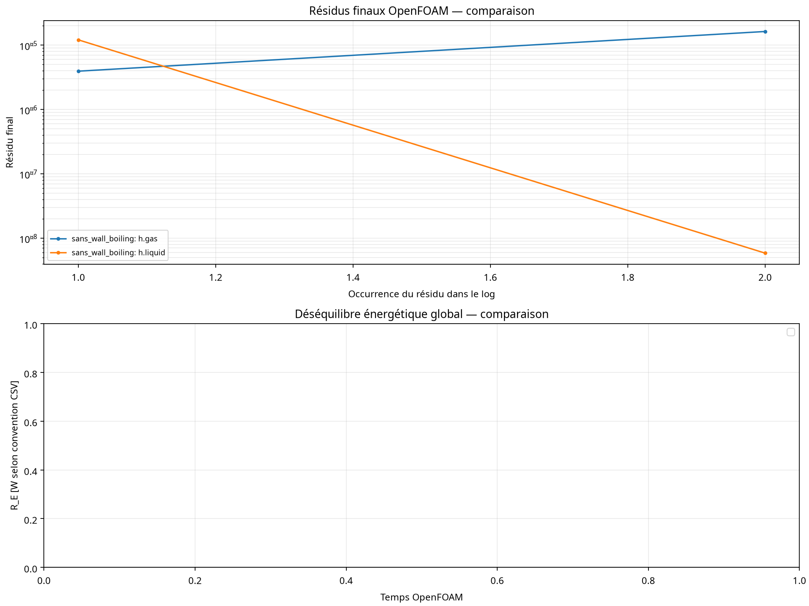

# Rapport technique et proposition de valeur — Pilote LH2

## Positionnement

Le pilote LH2 de Quantum-Hybrid-PINN est une plateforme logicielle en phase de qualification destinée à soutenir des prestations CFD, des démonstrations industrielles, des études de faisabilité et des projets de transfert technologique autour des écoulements diphasiques, de la thermique cryogénique et du machine learning scientifique.

La plateforme possède déjà les éléments d’une chaîne de preuve reproductible : contrat de données versionné, contrôle SHA-256, préparation OpenFOAM, intégration CoolProp, scripts de compilation, automatisation des cas, détection des NaN/FPE, post-traitement des bilans et production de visualisations.

Le statut physique du pilote reste **INCONCLUSIVE**. Cette formulation est volontaire et professionnelle : la plateforme ne présente pas une simulation instable comme une validation industrielle.

## Réalisations

| Domaine | Réalisé |
|---|---|
| Infrastructure logicielle | Dépôt versionné, contrats CFD, import contrôlé et persistance des artefacts |
| Docker | Diagnostic VFS, recommandations overlay2, cache BuildKit et nettoyage systemd |
| Initialisation LH2 | `alpha.gas=0.01`, `alpha.liquid=0.99`, `maxCo=0.02` |
| Thermodynamique | Tests CoolProp Python sur des états bornés et calcul de `psi` |
| Adaptateur C++ | Patch fail-closed pour pression absolue, `Tsat(p)`, états finis et `psi` |
| Exécution | Lanceur séquentiel sans wall-boiling puis wall1-only |
| Contrôle | Arrêt automatique sur NaN, Inf, FPE, timeout ou bilan manquant |
| Reporting | Rapport JSON, manifestes SHA-256, graphiques et synthèse de décision |
| Communication | Animation conceptuelle LH2, visuels géométriques et post commercialisable |

## État G0–G5

| Gate | Situation du pilote |
|---|---|
| G0 — Identité géométrique | Visuels conceptuels disponibles; source CAO LH2 autorisée, révision et hash final à fournir |
| G1 — Frontières | Dictionnaires et patches OpenFOAM présents; preuve de fermeture géométrique finale à compléter |
| G2 — Maillage | Artefacts de cas disponibles; rapport qualité du maillage LH2 de production manquant |
| G3 — Configuration | Contrat physique, CoolProp et réglages de stabilité préparés |
| G4 — Exécution | Scripts prêts, mais les logs historiques contiennent encore NaN/FPE et la VM finale n’est pas exécutée ici |
| G5 — Validation | Référence indépendante, incertitudes, deux runs finaux et seuils approuvés encore manquants |

## Médias disponibles

Les trois GIF `lh2_concept_animation_*.gif` sont des animations conceptuelles et non des sorties de solveur. Les dix-huit VTU présents dans le dépôt appartiennent à des kits de test ou à des designs de référence; aucun VTU issu d’une trajectoire OpenFOAM LH2 finale n’a été identifié dans `pilot_case/PILOT-LH2-001`. Les deux STL disponibles sont ceux du cas cylindre de démonstration et ne représentent pas une géométrie LH2 industrielle.

Les VTU conceptuels, lorsqu’ils sont présentés, doivent porter la mention **REFERENCE_DESIGN** ou **SYNTHETIC_TEST**. Une animation CFD commercialisable devra être exportée depuis les frames réelles d’OpenFOAM après convergence et contrôle des bilans.

## Visualisations pertinentes

### Géométrie conceptuelle du pilote

*Figure 1 — Domaine conceptuel 2D du pilote LH2, avec entrée, sortie et zones liquide/vapeur. Cette figure est pertinente pour expliquer l’identité géométrique préliminaire et le contrat de cas. Elle est explicitement **conceptuelle** et **ne constitue pas un résultat CFD validé ni une preuve de géométrie industrielle**.*

### Diagnostic des résidus disponibles

*Figure 2 — Diagnostic des résidus réellement disponibles. Les résidus affichés sont élevés et non convergents; le panneau de bilan énergétique est vide, car aucun CSV de bilan énergétique réel n’était disponible au moment de l’audit. Cette figure est pertinente pour documenter le statut **INCONCLUSIVE**, mais ne doit pas être présentée comme une comparaison convergée entre deux simulations.*

### Médias non pertinents pour une preuve CFD

Les GIF conceptuels, les VTU synthétiques ou de design de référence et les STL du cas cylindre peuvent illustrer l’interface, la géométrie ou le flux de visualisation. Ils ne sont pas pertinents comme preuves de convergence LH2 OpenFOAM et doivent rester étiquetés **CONCEPTUAL**, **SYNTHETIC_TEST** ou **REFERENCE_DESIGN**.

## Risque technique principal

L’activation du wall-boiling déclenche actuellement une instabilité interfaciale observée dans `Tf.gasAndLiquid` et `iDmdt.gasAndLiquid`. La séquence de réduction du risque est déjà définie : thermodynamique sans wall-boiling, activation sur une seule paroi, contrôle des propriétés `p,T,rho,psi,alphat,iDmdt`, puis deux trajectoires indépendantes.

Le projet doit être vendu comme une **capacité de qualification et de prestation instrumentée**, et non comme une certification déjà obtenue. La valeur commerciale réside dans la réduction du temps de diagnostic, la traçabilité des hypothèses et l’interdiction automatique de publier un résultat non démontré.

## Offres possibles

| Offre | Livrable commercial |
|---|---|
| Audit de modèle CFD | Revue des dictionnaires, propriétés, conditions aux limites, maillage et résidus |
| Prestation de simulation | Cas OpenFOAM préparé, exécution contrôlée, logs et rapport de décision |
| Validation de données | Import VTU/VTK, contrôle topologique, unités, hachages et provenance |
| Intégration PINN-T | Jeu d’entraînement séparé, évaluation held-out, métriques et reproductibilité |
| Démonstrateur industriel | Dashboard, animations et exports issus de cas autorisés |
| Collaboration financière | Financement d’un cas de référence, acquisition de données et qualification conjointe des artefacts |

## Conditions de passage en production

La production LH2 ne pourra être annoncée qu’après compilation dans une VM OpenFOAM complète, deux runs indépendants sans valeur non finie, résidus maîtrisés, bilans masse-énergie disponibles, manifestes SHA-256 complets et comparaison avec une référence définie avant l’évaluation.

## Conclusion

Le pilote offre une base crédible pour vendre une prestation de qualification CFD/PINN-T, un démonstrateur industriel ou une collaboration de développement commercial. Sa force actuelle est la transparence et l’instrumentation. Sa prochaine étape est l’exécution OpenFOAM réelle dans une VM complète et la production de preuves physiques finales.
